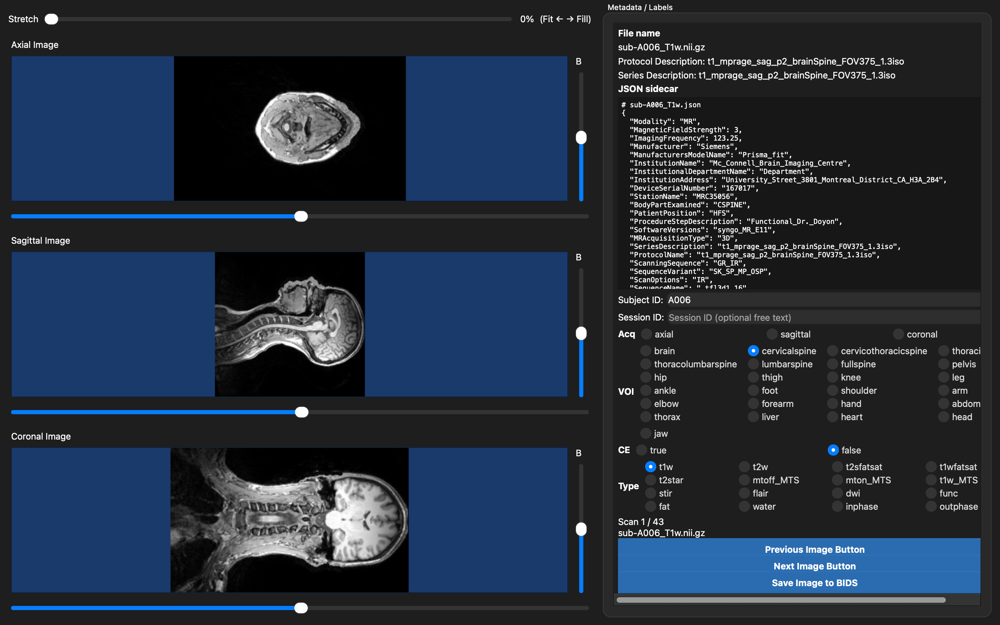

# MRI Sorting Tool

Desktop GUI for labeling MRI NIfTI scans and saving them into a lab BIDS-like layout.



*Beta UI: compact JSON sidecar that fills the side panel; optional Subject/Session IDs; Acq / VOI / CE / Type.*

**Saves are copy-only:** the tool never moves or modifies the original NIfTI or JSON files. It **copies** each scan into the output tree and writes a **new** sidecar beside the copy.

## Requirements

- Python 3.10+
- PyQt6, nibabel, numpy, scipy (installed via `requirements.txt`)

## Install (any machine)

```bash
git clone https://github.com/NeuromuscularInsightLab/clinicalDICOM2BIDS-sorting-tool.git
cd clinicalDICOM2BIDS-sorting-tool
python3 -m venv .venv
source .venv/bin/activate          # Windows: .venv\Scripts\activate
pip install -r requirements.txt
pip install -e .
```

## For developers

Every module under `sorting_tool/` opens with a docstring in the same
shape — **HOW THIS FITS IN** (who calls it, what it calls) and **HOW TO
EXTEND** (the specific functions to edit for common changes). That
docstring is the source of truth; the map below is just the index into it.

### Pipeline

```text
__main__.main()                    CLI args / interactive prompts
    -> app.run_app(input_dir, output_dir)
        -> discovery.discover_scans()      find *.nii/*.nii.gz under input_dir
        -> app.MainWindow                  builds the window, loads scan 0
            -> metadata.extract_meta()     per-scan sidecar + filename guesses
            -> viewer.OrthoViewer          renders axial/sagittal/coronal
            -> [user edits labels, clicks Save]
            -> bids.save_to_bids()         copy + rename + new sidecar
                -> discovery.mark_saved()  record progress
```

Nothing here writes back into the input tree — `bids.save_to_bids` only
ever *copies* into the output tree. If you touch `bids.py`, keep that
invariant.

### Module map

| Module | Owns | Talks to | Edit it when you want to... |
|---|---|---|---|
| [`__main__.py`](sorting_tool/__main__.py) | CLI arg parsing / interactive path prompts | calls `app.run_app` | add a CLI flag, change prompt wording, add a non-GUI batch mode |
| [`app.py`](sorting_tool/app.py) | `MainWindow` (orchestration/layout), `RadioRow` widget, `prompt_directories`, `run_app` | calls `discovery`, `metadata`, `viewer`, `bids`; owns no filename/BIDS logic itself | add/rearrange a GUI field, change post-save navigation, change how the output dataset folder is named |
| [`discovery.py`](sorting_tool/discovery.py) | finding scans (`discover_scans`) and the `sorting_progress.json` "already saved" tracker | called by `app` (find scans, check saved) and `bids` (`mark_saved` after a copy) | support another input extension, change where/how progress is persisted |
| [`metadata.py`](sorting_tool/metadata.py) | `ScanMeta`, sidecar/filename parsing, the `*_OPTIONS` label vocabularies, and all `_guess_*` heuristics | called by `app.load_index` to prefill fields; `sidecar_for()` also used by `bids` to locate the source JSON | add/rename a label choice (Acq/VOI/CE/Type — also update the README table below), improve auto-detection of subject/session/plane/anatomy/type |
| [`bids.py`](sorting_tool/bids.py) | destination path/filename construction (`build_stem`, `build_bids_paths`), the actual copy + sidecar write (`save_to_bids`), entity sanitizing | called by `app.save_scan`; calls `metadata.sidecar_for` and `discovery.mark_saved` | change filename/folder naming convention, add a new BIDS entity, change collision (`_run-N`) handling, change what's stored in the destination sidecar's `SortingTool` block |
| [`viewer.py`](sorting_tool/viewer.py) | `OrthoViewer` / `PlaneView` / `ImageCanvas` — slice, brightness, zoom, pan, fit↔stretch rendering | called by `app` (`set_volume`/`clear`); self-contained otherwise | change windowing/brightness math, add a plane or MIP, change zoom limits or aspect handling |

### Where to make common changes

- **Add or rename an Acq / VOI / CE / Type option** — edit the matching
  `*_OPTIONS` list in `metadata.py`, update the corresponding `_guess_*`
  if it should be auto-detected, and update the "Label options" table
  further down in this README. `app.py`'s radio rows read these lists
  directly, so no GUI code changes are needed.
- **Wire up a brand-new GUI field** (beyond Acq/VOI/CE/Type) — add a
  widget in `app.MainWindow.__init__` (see `RadioRow` or the
  Subject/Session `QLineEdit`s), pass its value into `save_to_bids(...)`
  (via a new kwarg or the `labels=` dict), and decide whether it belongs
  in the filename (`bids.build_stem`) or only in the sidecar.
- **Change the output filename/folder pattern** — `bids.build_stem` (stem)
  and `bids.build_bids_paths` (folder layout + collision handling).
- **Improve subject/session/plane/anatomy detection** — the `_subject_from_*`,
  `_session_from_*`, and `_guess_*` functions in `metadata.py`; they must
  stay best-effort and never raise (return `""`/`None` on unknown input).
- **Change viewer behavior** (zoom limits, brightness windowing, fit vs.
  fill) — entirely inside `viewer.py`; `app.py` only calls `set_volume`/
  `clear`/`set_stretch` and never touches pixels directly.
- **Change progress tracking** (`sorting_progress.json`) — `discovery.py`
  (`PROGRESS_NAME`, `load_progress`, `mark_saved`, `is_saved`).
- Keep [`tests/test_metadata_bids.py`](tests/test_metadata_bids.py) in sync
  when you change label vocabularies or naming/collision rules — it
  exercises `discover_scans`, `extract_meta`, `build_stem`,
  `build_bids_paths`, and `save_to_bids` directly.

## Run

### 1. Activate the environment

Every time you open a new terminal, go into the repo and activate the virtualenv:

```bash
cd clinicalDICOM2BIDS-sorting-tool
source .venv/bin/activate          # Windows: .venv\Scripts\activate
```

You should see `(.venv)` at the start of your prompt.

### 2. Launch the tool

```bash
sorting-tool
```

(or `python -m sorting_tool`)

The terminal will ask:

1. `Input folder path:` — paste or type the **input folder PATH** (root folder that contains your NIfTI scans). The tool searches this folder recursively for `.nii` / `.nii.gz`.
2. `Output folder path:` — paste or type the **output folder PATH** (parent directory for sorted BIDS results). The tool creates a subfolder named after the input folder inside this path.

Then the GUI window opens.

Sorted copies are written under:

```text
/OUTPUT/FOLDER/PATH/<input_folder_name>/sub-<ID>/ses-<sessionid>/...
```

Original files under the input folder PATH are never modified or moved.

### 3. Use the GUI

1. Confirm the **file name** and scroll the **JSON sidecar** panel on the right.
2. Confirm Protocol / Series text (summarized above the labels).
3. Optionally edit **Subject ID** and **Session ID** (free-text strings; may be left blank).
4. Select **Acq**, **VOI**, **CE** (`true` / `false`), and **Type** / suffix (one choice each).
5. Use the left viewports to inspect axial / sagittal / coronal slices (slice + brightness sliders).
6. Click **Save Image to BIDS** to **copy** the current scan into the output folder PATH using those labels.
7. Click **Next Image Button** / **Previous Image Button** to move through the dataset.

### Viewing controls

- **Stretch** slider at the top of the image column (default **0% = Fit**):  
  - `0` keeps aspect ratio  
  - `100` fills the viewport  
  - values in between blend Fit → Fill
- **Scroll wheel** on an image: zoom in/out.
- **Click-drag** on an image: pan.
- **Double-click** an image: reset zoom and pan.

## Output naming

Top-level folder matches the **input dataset folder name**:

```text
<output>/<input_dataset_name>/
  sub-<subjectid|/unknown>/
    ses-<sessionid|/unknown>/
      [sub-<subjectid>_][ses-<sessionid>_]acq-<acq>_voi-<voi>_ce-<true|false>[_run-N]_<suffix>.nii.gz
      [sub-<subjectid>_][ses-<sessionid>_]acq-<acq>_voi-<voi>_ce-<true|false>[_run-N]_<suffix>.json
```

- **Subject ID** and **Session ID** are optional. If blank, they are omitted from the **filename**, and folders use `sub-unknown` / `ses-unknown`.
- There is **no** `desc-` entity. Contrast is encoded as **`ce-true`** or **`ce-false`**.
- If a name already exists, `_run-<N>` is inserted before the suffix.

Example:

```text
sub-subjectid_ses-sessionid_acq-axial_voi-lumbarspine_ce-false_t1w.nii.gz
```

### Label options

| Field | Options |
|-------|---------|
| `acq` | `axial`, `sagittal`, `coronal` |
| `voi` | `brain`, `cervicalspine`, `cervicothoracicspine`, `thoracicspine`, `thoracolumbarspine`, `lumbarspine`, `fullspine`, `pelvis`, `hip`, `thigh`, `knee`, `leg`, `ankle`, `foot`, `shoulder`, `arm`, `elbow`, `forearm`, `hand`, `abdomen`, `thorax`, `liver`, `heart`, `head`, `jaw` |
| `ce` | `true`, `false` |
| suffix | `t1w`, `t2w`, `t2sfatsat`, `t1wfatsat`, `t2star`, `mtoff_MTS`, `mton_MTS`, `t1w_MTS`, `stir`, `flair`, `dwi`, `func`, `fat`, `water`, `inphase`, `outphase` |

Progress is tracked in `sorting_progress.json` under the dataset output folder.

## Tests

```bash
source .venv/bin/activate          # Windows: .venv\Scripts\activate
python -m unittest discover -s tests -v
```
