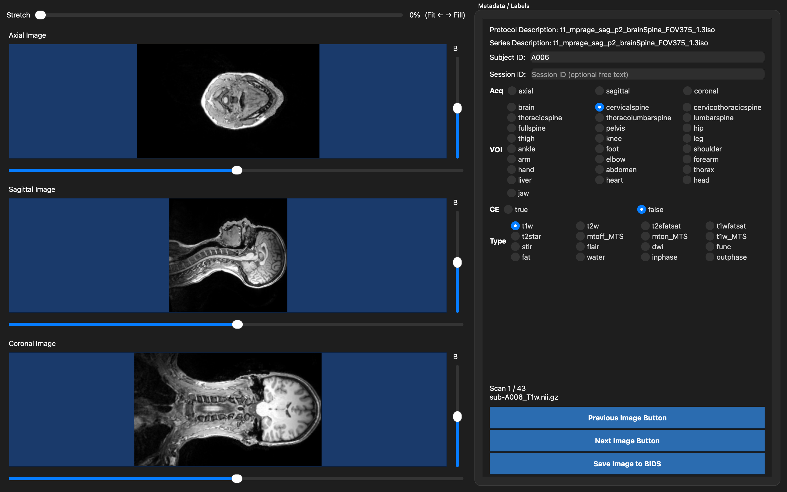

# MRI Sorting Tool

Desktop GUI for labeling MRI NIfTI scans and saving them into a lab BIDS-like layout.



**Saves are copy-only:** the tool never modifies the original NIfTI or JSON files. It copies each scan into the output tree and writes a new sidecar beside the copy.

## Requirements

- Python 3.10+
- PyQt6, nibabel, numpy, scipy (installed via `requirements.txt`)

## Install (any machine)

```bash
git clone https://github.com/klasinlapaprechar/sorting-tool.git
cd sorting-tool
python3 -m venv .venv
source .venv/bin/activate          # Windows: .venv\Scripts\activate
pip install -r requirements.txt
pip install -e .
```

## Run

### 1. Activate the environment

Every time you open a new terminal, go into the repo and activate the virtualenv:

```bash
cd sorting-tool
source .venv/bin/activate          # Windows: .venv\Scripts\activate
```

You should see `(.venv)` at the start of your prompt.

### 2. Launch the tool

**Option A — interactive (folder picker dialogs)**

```bash
sorting-tool
```

(or `python -m sorting_tool`)

1. A dialog asks for the **input folder PATH** — choose the root folder that contains your NIfTI scans (`.nii` / `.nii.gz`). The tool walks this folder recursively.
2. A second dialog asks for the **output folder PATH** — choose the parent directory where sorted BIDS data should be written. The tool creates a subfolder named after the input folder inside this path.

**Option B — pass PATH arguments on the command line**

```bash
sorting-tool --input /INPUT/FOLDER/PATH --output /OUTPUT/FOLDER/PATH
```

| Argument | Meaning |
|----------|---------|
| `--input` / `-i` | **Input folder PATH** — root of the dataset to label (searched recursively for `.nii` / `.nii.gz`). The last component of this path becomes the top-level dataset name in the output. |
| `--output` / `-o` | **Output folder PATH** — parent directory for results. Saved scans go under `/OUTPUT/FOLDER/PATH/<input_folder_name>/...`. |

Example:

```bash
sorting-tool \
  --input /Users/you/data/TestData \
  --output /Users/you/data/sorted
```

This writes copies to:

```text
/Users/you/data/sorted/TestData/sub-<ID>/ses-<YYYYMMDD>/...
```

Original files under the input folder PATH are never modified.

### 3. Use the GUI

1. Confirm Protocol / Series text from the JSON sidecar (shown at the top right).
2. Edit **Subject ID** and **Session date** (`YYYYMMDD` or `unknown`) if needed.
3. Select **Acq**, **VOI**, **Desc**, and **Type** (one choice each).
4. Use the left viewports to inspect axial / sagittal / coronal slices (slice + brightness sliders).
5. Click **Save Image to BIDS** to **copy** the current scan into the output folder PATH using those labels.
6. Click **Next Image Button** / **Previous Image Button** to move through the dataset.

If you omit `--input` / `--output`, the tool prompts for the input folder PATH and output folder PATH in the terminal as well when launched without dialogs available.

### Viewing controls

- **Stretch** slider at the top of the image column (default **0% = Fit**):  
  - `0` keeps aspect ratio  
  - `100` fills the viewport  
  - values in between blend Fit → Fill
- **Scroll wheel** on an image: zoom in/out.
- **Click-drag** on an image: pan.
- **Double-click** an image: reset zoom and pan.

## Output naming

Top-level folder matches the **input dataset folder name**:

```text
<output>/<input_dataset_name>/
  sub-<ID>/
    ses-<YYYYMMDD>/
      sub-<ID>_ses-<YYYYMMDD>_voi-<voi>_acq-<acq>[_desc-<desc>]_<type>.nii.gz
      sub-<ID>_ses-<YYYYMMDD>_voi-<voi>_acq-<acq>[_desc-<desc>]_<type>.json
```

Label values:

| Field | Options |
|-------|---------|
| `voi` | `cervical`, `lumbar`, `brain`, `thoracic` |
| `acq` | `axial`, `sagittal` |
| `desc` | omitted when `none`; else `fatSat_Pre_gad` or `fatSat_Post_gad` |
| type suffix | `t2w`, `t2star`, `t1` |

Example:

```text
TestData/sub-amuAL/ses-20220812/sub-amuAL_ses-20220812_voi-cervical_acq-sagittal_desc-fatSat_Post_gad_t1.nii.gz
```

If a name already exists, `_run-<N>` is inserted before the type suffix. Progress is tracked in `sorting_progress.json` under the dataset output folder.

## Tests

```bash
source .venv/bin/activate          # Windows: .venv\Scripts\activate
python -m unittest discover -s tests -v
```
